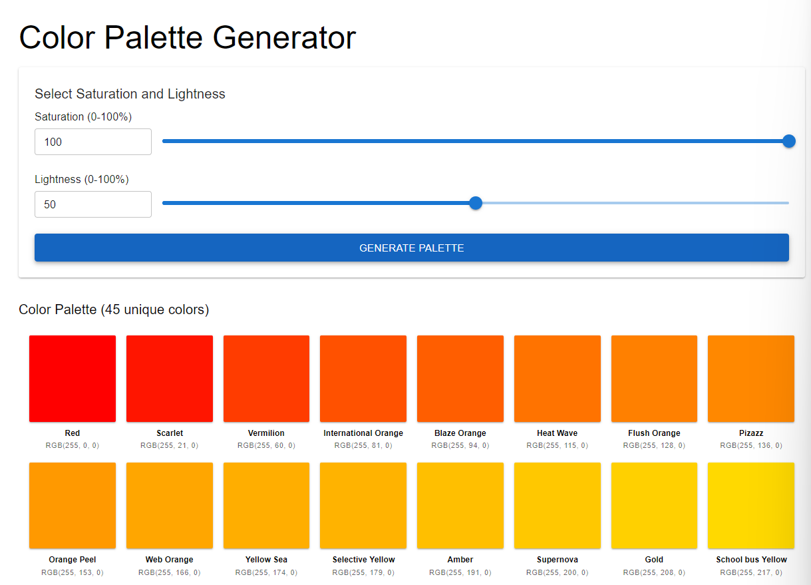

# Color Palette Generator



A React application that generates unique color palettes from Saturation and Lightness parameters.

## Design decisions

### Mitigating API calls

The key issue of this task is to overcome the repeated API calls that could be detrimental to the best user experience, a few techniques were used to improve the user experience

- S/L caching: We'll only fetch all the colors for an S/L pair a single time. This keeps the last 20 calls cached, reducing time to display while being mindful of memory usage.
- Batching and parallel fetching, the repeated color fetches are done in batches and wrapped in Promise.allSettled() significantly improving performance and user experience.
- An animated loading screen is introduced while the user is waiting (which only lasts a couple of seconds). The "Generate Palette" button is disabled while the palette is loading giving a foolproof user experience.

## Prerequisites

- Node.js (v16 or higher recommended)
- npm

## Installation

```bash
npm install
```

## Running the Application

### Development Mode

Run the app in development mode with hot module replacement:

```bash
npm run dev
```

The app will be available at `http://localhost:5173`

### Production Build

Build the application for production:

```bash
npm run build
```

This compiles TypeScript and creates an optimized production build in the `dist/` folder.

### Preview Production Build

To preview the production build locally:

```bash
npm run preview
```

The production build will be served at `http://localhost:4173`.

**Important**: Do not open `dist/index.html` directly in your browser. Modern JavaScript modules require a web server to function properly due to CORS restrictions.
